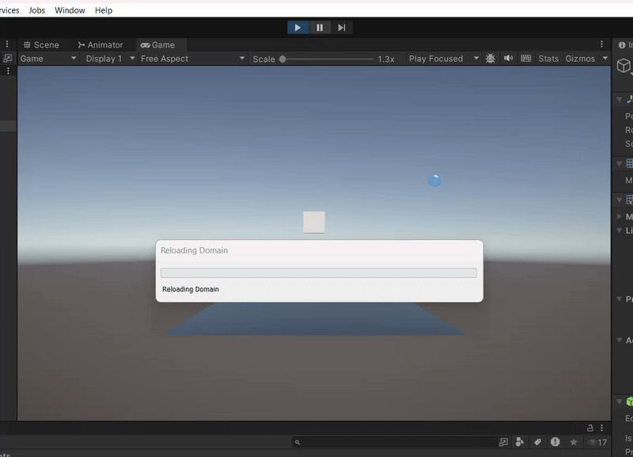

# tutorials
 

tutorial 0:
Kubus kan springen (https://github.com/Cats-R-Cool/tutorials/blob/main/tutorial%200/Assets/scripts/LaunchCube.cs)
 

 tutorial 1:
 Ik heb een model met een idle en dans animatie (https://github.com/Cats-R-Cool/tutorials/blob/main/tutorial%200/Assets/scripts/character.cs)
 

 tutorial 2:
 Mijn model kan nu ook rond lopen (https://github.com/Cats-R-Cool/tutorials/blob/main/tutorial%200/Assets/scripts/Movement.cs)
 (https://github.com/Cats-R-Cool/tutorials/blob/main/tutorial%200/Assets/scripts/character.cs)

tutorial 3:
De kubus kan bewegen en van platform naar platform springen (https://github.com/Cats-R-Cool/tutorials/blob/main/tutorial%200/Assets/scripts/jump.cs)
(https://github.com/Cats-R-Cool/tutorials/blob/main/tutorial%200/Assets/scripts/Movement.cs)

